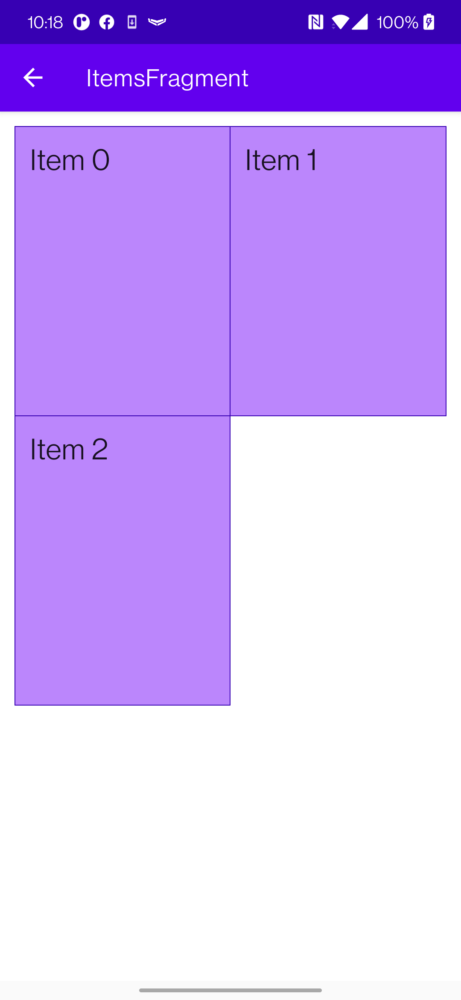

Sample project shows an example how to use merged background when using `RecyclerView` and `GridLayoutManager`.

-   Sample in how to use regular backgrounds
-   Sample in how to use regular backgrounds + paddings
-   Sample in how to use merged backgrounds together

